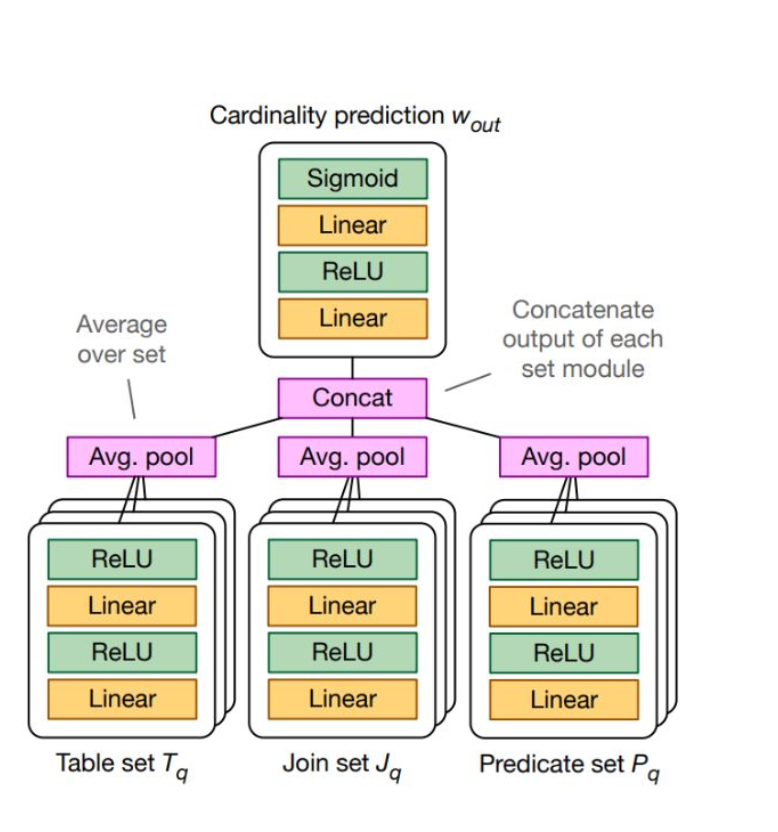

# MSCN 구현 및 Attention 기반 개선 시도

## 프로젝트 개요

본 프로젝트는 SQL Cardinality Estimation을 위한 MSCN (Multi-Set Convolutional Network) 모델을 재현하고,
이를 기반으로 Attention 메커니즘을 추가하여 확장한 프로젝트입니다.

MSCN은 SQL 쿼리를 tables, joins, predicates의 집합(set)으로 표현하고,
각 집합을 MLP 기반으로 처리하여 결과 cardinality를 예측하는 모델입니다.

---

## What I Did

* MSCN 구조 재현 (set-based encoding + MLP aggregation)
* query를 **samples / predicates / joins**로 분리하여 처리
* bitmap 기반 feature encoding 및 normalization 구현
* PyTorch 기반 모델 및 학습 파이프라인 구축

---

## 모델 구조

모델은 다음 세 가지 입력을 기반으로 구성됩니다:

- Table set
- Join set
- Predicate set

각 set은 독립적으로 encoding된 후 평균 pooling을 통해 집합 표현으로 변환됩니다.

---

## 모델 확장 (Attention)

기존 MSCN은 평균 기반 aggregation을 사용하기 때문에
predicate와 join 간 관계를 충분히 반영하기 어렵다고 판단했습니다.

이를 개선하기 위해 Attention 구조를 추가했습니다.

### Self-Attention
- 동일 set 내부 요소 간 관계 학습
- 예: predicate 간 상호 영향 반영

### Cross-Attention
- 서로 다른 set 간 관계 학습
- 예: predicate ↔ join 간 상호작용 반영

이후 모든 정보를 결합하여 최종 cardinality를 예측합니다.

---

## 구현 내용

- Framework: PyTorch
- Query 표현 방식:
  - tables, joins, predicates를 set 형태로 encoding
  - one-hot encoding + normalization 적용
- 모델 구성:
  - MLP 기반 feature extraction
  - Multi-head attention (self + cross)
  - variable-length input을 위한 masking 처리

---

## 현재 진행 상태

- MSCN baseline 모델 재현 완료
- Attention 기반 확장 구조 구현 완료
- 전체 데이터 처리 및 학습 파이프라인 구성 완료

---

## 문제 상황 및 향후 개선 방향

학습 과정에서 Q-error spike(불안정한 loss)가 발생하는 문제를 확인했습니다.

현재 고려 중인 개선 방향:

- regularization 기법 적용 (dropout tuning, weight decay 등)
- attention entropy 분석을 통한 학습 안정성 개선
- attention 구조 및 하이퍼파라미터 추가 튜닝

---

## 배운 점

- SQL 쿼리를 set 구조로 표현하는 방법 이해
- Cardinality Estimation 문제를 ML 문제로 다루는 방식 이해
- Attention 메커니즘이 구조적 데이터에 적용되는 방식 학습
- 딥러닝 모델 학습 시 발생하는 안정성 문제 경험

---

## 참고 논문

[1] [Kipf et al., Learned Cardinalities: Estimating Correlated Joins with Deep Learning, 2018](https://arxiv.org/abs/1809.00677)

[2] [Kipf et al., Estimating Cardinalities with Deep Sketches, 2019](https://arxiv.org/abs/1904.08223)